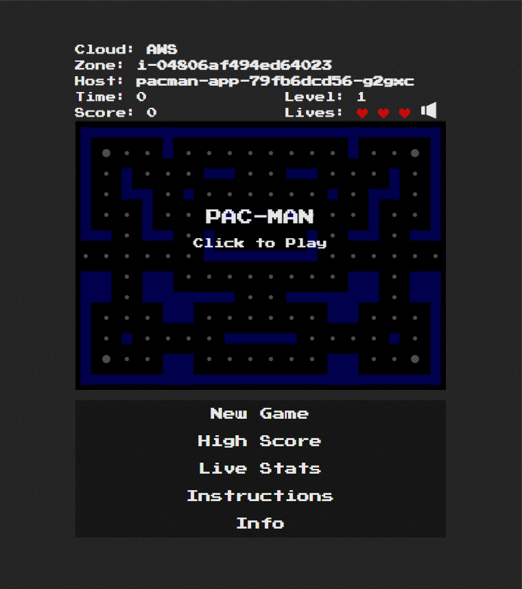
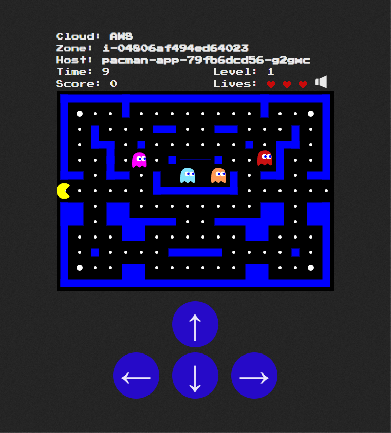

# 🕹️ Multi-Tier Pacman Application on AWS EKS with GitOps CI/CD

A production-grade, highly available deployment of a classic web-based Pacman application hosted on a managed **Amazon Elastic Kubernetes Service (EKS)** cluster. This project demonstrates modern cloud-native engineering, secure CI/CD orchestration using IAM OIDC, modular backend design, and dynamic environment metadata discovery.

## 📺 Application Interface & Live Metadata

The application features a retro-styled retro dashboard that bridges the classic arcade frontend with a cloud-native backend telemetry engine. 

### 1. Main Menu & Cluster Discovery
When the client initializes the game, the frontend triggers an immediate asynchronous AJAX synchronization handshake against the custom dynamic cloud geolocation route (`/location/metadata`).

<p align="center">
  
</p>

* **Cloud Layer Decoupling:** Dynamically identifies the hosting infrastructure vendor (**AWS**) without hardcoded environment profiles.
* **Instance Telemetry Map:** Surfaces the active, ephemeral worker host compute identity context directly to the gaming engine interface layer.

### 2. Active Gameplay & Interactive Control States
Once the session begins, responsive touch-control overlays adjust dynamically based on the client device screen state, enabling cross-platform desktop and mobile accessibility.

<p align="center">
  
</p>

* **Dynamic Ingress Performance:** High-speed Web Canvas pathfinding algorithms fetch map layouts and render real-time entity indexing under low-latency network constraints.
* **Integrated Controls Refactoring:** The user interface features custom, fully refactored container stylesheets optimizing interactive touch control button fields.

---

## 🏗️ Architectural Overview

The application follows a resilient, decoupled multi-tier architecture designed for scalable cloud operations:

[ Internet ] ──► [ AWS Network Load Balancer (NLB) ]

│

(Port 80 to 8080)

▼

[ Pacman App Pods (ReplicaSet x3) ]

(Node.js / Express Backend)

(HTML5 Canvas / HTML Frontend)

│

(Internal Cluster IP: 27017)

▼

[ MongoDB StatefulSet ]

(Persistent Storage Tier gp3)


### Key Engineering Wins & Implemented Enhancements:
* **Zero-Secret OIDC Authentication (Passwordless):** Migrated the entire deployment lifecycle away from risky, static AWS IAM Access Keys. The GitHub Actions runner assumes temporary AWS IAM Roles securely via OpenID Connect (OIDC) federation with strict trust policies.
* **Non-Hardcoded Cloud Discovery:** Programmed the Express backend to dynamically pull the cloud vendor state and native AWS worker node metadata (`spec.nodeName`) directly out of the runtime container environment variables, eliminating hardcoded zone references.
* **Automated GitOps Rollouts:** Constructed a declarative deployment sync step using a cache-free Docker build engine (`--no-cache`) and atomic Kubernetes rolling updates (`kubectl rollout status`), achieving zero-downtime application updates.
* **VPC Layer Direct Ingress Routing:** Configured the `AWS Load Balancer Controller` to route incoming internet traffic straight to target Pod IP addresses (`aws-load-balancer-nlb-target-type: "ip"`) to optimize packet latency within the AWS network.
* **Modernized UI Control States:** Upgraded legacy browser-side `ApplicationCache` (AppCache) layers to enforce clean resource delivery, and refactored core application CSS assets to modernize the front-end layout styling.

---

## 🛠️ Environment Variables & Configuration

The application container uses explicit environmental variables to decouple application business logic from underlying cluster environments:

| Variable Name | Active Value Source | Purpose / Description |
| :--- | :--- | :--- |
| `CLOUD_PROVIDER` | `AWS` | Static platform tracking token evaluated by the geolocation router. |
| `AWS_ZONE` | `fieldRef: spec.nodeName` | Dynamic environment hook extracting the exact AWS EC2 instance identifier. |
| `MONGO_SERVICE_HOST`| `mongo` | Core internal cluster DNS endpoint resolving to the database state. |
| `MONGO_DATABASE`    | `pacman` | Target database ledger catalog name initialized by the storage container. |
| `MY_MONGO_PORT`     | `27017` | Standard networking communications port for the storage node interface. |
| `MONGO_URL`          | `mongodb://mongo:27017/...` | Fully formulated data layer connection string supporting data replication. |

---

## 📁 Repository Structure Map

Based on the official production codebase footprint:

```text
├── .github/workflows/
│   └── main.yml           # Passwordless OIDC GitHub Actions CI/CD Pipeline
├── bin/
│   └── server.js          # Node.js Network Server Initialization Wrapper
├── docker/
│   ├── dev/               # Local Development Docker Environments & Shell Scripts
│   └── Dockerfile         # Production Multi-Stage Base App Docker Blueprint
├── eks/
│   └── eks-cluster.yaml   # AWS EKS Cluster Provisioning Specification Template
├── k8s/
│   ├── storage-class.yaml # Custom AWS Amazon EBS CSI Storage Controller 
│   ├── db-sts.yaml        # Resilient MongoDB StatefulSet Ledger Stack
│   └── app-deployment.yaml# Pacman Core App Replicas & LoadBalancer Service
├── lib/
│   └── database.js        # Native MongoDB Connection Lifecycle Logic
├── routes/
│   └── location.js        # Clean Express Router handling dynamic cloud metadata
└── public/
    ├── css/style.css      # Custom UI Styling (Features Blue Navigation Upgrades)
    └── js/pacman-canvas.js# Core Frontend HTML5 Game Physics Engine
```

---

## 🚀 CI/CD Pipeline Automation Lifecycle

The delivery process is managed end-to-end via an active **GitHub Actions** multi-stage engine:

1. **Secure Handshake State:** Authenticates into Amazon Web Services via an OIDC Identity Provider match using short-lived credentials.
2. **Clean Image Assembly:** Executes a verified `--no-cache` Docker compilation inside the runner context using the project's specialized `docker/Dockerfile`.
3. **Registry Synchronization:** Logs directly into private **Amazon ECR** scopes and pushes the generated immutable version tag (`${{ github.sha }}`).
4. **Cluster Synchronization:** Updates the AWS Kubernetes control plane and runs a managed rolling rollout (`kubectl rollout status deployment pacman-app`) to ensure verified pod health.

---

## ⚡ Deployment & Local Operations

### Prerequisites
* Fully updated `kubectl` binary mapped to your AWS EKS context.
* Formulated `aws-cli` shell profiles.

### Declarative Installation
Apply the resources sequentially to spin up the multi-tier application layers inside any operational namespace:

```bash
# 1. Apply storage layers and disk endpoints
kubectl apply -f k8s/storage-class.yaml
kubectl apply -f k8s/db-sts.yaml

# 2. Deploy app replicas and expose the Internet-Facing Network Load Balancer
kubectl apply -f k8s/app-deployment.yaml
```
